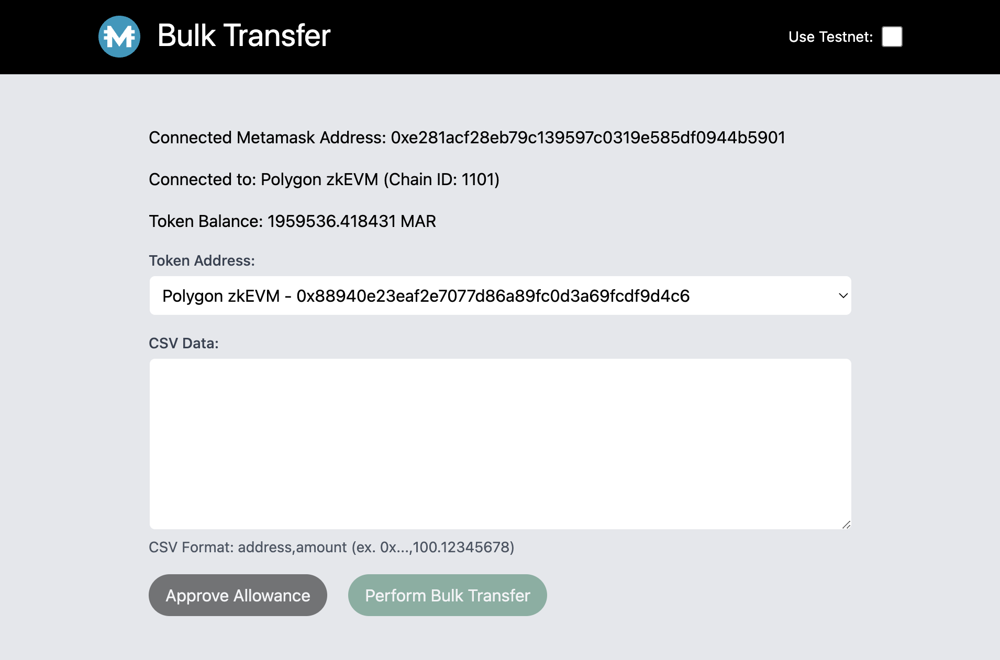

# Bulk Transfer UI and Server

This repository contains a simple UI and a server for handling bulk transfers of MAR ERC20 tokens using the Ethereum blockchain, Polygon PoS and Polygon zkEVM. It provides a user-friendly way to send tokens to multiple recipients in one go, directly from your browser, with the help of Metamask.

# Screenshot



## Files

- `server.js`: This is a simple Express.js server to serve the static bulk-transfer-ui.html file.

- `bulk-transfer-ui.html`: This HTML file provides a UI to perform bulk token transfers. You'll need to select the token contract address and the list of recipients and amounts in CSV format. It also allows you to approve a token allowance via Metamask.

## Setup

### Prerequisites

- Node.js and npm installed on your system
- Metamask browser extension installed for interacting with the Ethereum blockchain, Polygon PoS and Polygon zkEVM

### Installation

1. Clone the repository:

    ```bash
    git clone https://github.com/MchainNetwork/bulk-transfer-ui.git
    ```

2. Navigate to the project directory and install the required npm packages:

    ```bash
    cd ./bulk-transfer-ui
    npm install
    ```

### Run

1. Start the server:

    ```bash
    npm start
    ```

    Open your default web browser at `http://localhost:3000`.

2. Interact with the Bulk Transfer UI in the browser.

3. Use Metamask to approve and submit transactions to the Ethereum, Polygon PoS or Polygon zkEVM blockchain.

## Usage

- Open the Bulk Transfer UI via your web browser.

- Select the MAR ERC20 token contract address for the appropiate network.

- Paste the list of recipients and amounts in CSV format (address,amount) into the text area.

- Click the "Approve Allowance" button to allow the bulk transfer of the total amount.

- Click the "Perform Bulk Transfer" button to initiate the bulk transfer.

## Contributing

Feel free to fork this repository, make changes, and open pull requests. For significant changes, please open an issue first.
